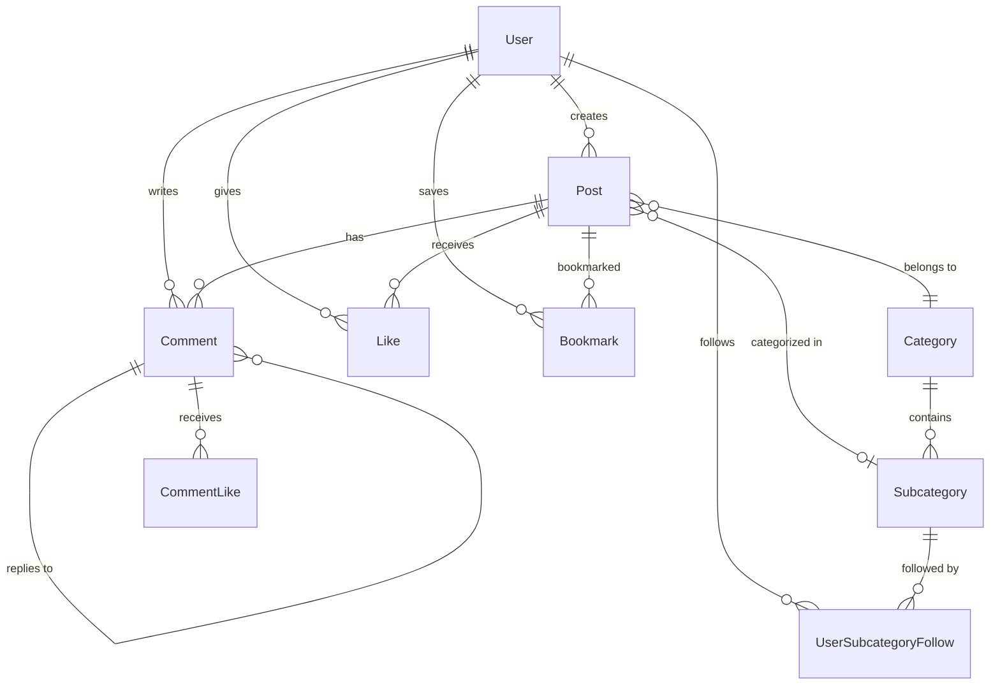

# 🚀 CodeQuest 2025 - Backend API

<div align="center">


_Una API REST robusta y escalable construida con .NET 8 y PostgreSQL para la plataforma de blogging CodeQuest 2025_ ✨

</div>

---

### ✨ Características Principales

- 🔐 **Autenticación JWT**: Sistema de autenticación seguro y robusto
- 🎮 **Integración Discord**: Login OAuth con Discord
- 📝 **Gestión de Publicaciones**: CRUD completo de posts con Markdown
- 💬 **Sistema de Comentarios**: Comentarios anidados y likes
- 🏷️ **Categorías y Subcategorías**: Organización jerárquica del contenido
- ⭐ **Sistema de Likes**: Likes en posts y comentarios
- 🔖 **Marcadores**: Sistema de favoritos para usuarios
- 🔔 **Notificaciones en Tiempo Real**: WebSockets para notificaciones instantáneas
- 👑 **Sistema Stardust**: Gamificación con puntos y rankings
- 📊 **Analytics y Rankings**: Métricas de popularidad y tendencias
- 🛡️ **Autorización por Roles**: Sistema de permisos granular
- 📱 **API RESTful**: Endpoints bien documentados y consistentes

---

## 🛠️ Stack Tecnológico

### Backend Core

- **.NET 8** - Framework moderno y de alto rendimiento
- **ASP.NET Core** - Framework web robusto y escalable
- **C# 12** - Lenguaje de programación moderno y type-safe

### Base de Datos

- **PostgreSQL** - Base de datos relacional de código abierto
- **Entity Framework Core 9** - ORM moderno y eficiente
- **Npgsql** - Proveedor PostgreSQL para .NET

### Autenticación y Seguridad

- **JWT Bearer** - Tokens de autenticación seguros
- **BCrypt** - Hashing seguro de contraseñas
- **Discord OAuth 2.0** - Autenticación social

### Herramientas y Utilidades

- **AutoMapper** - Mapeo automático de objetos
- **Swagger/OpenAPI** - Documentación automática de API
- **CORS** - Configuración de políticas de origen cruzado

---

## 🚀 Instalación y Configuración

### Prerrequisitos

Asegúrate de tener instalado:

- **.NET 8 SDK** (versión 8.0 o superior)
- **Visual Studio 2022** o **VS Code** con extensión C#
- **Git** para control de versiones

> 💡 **Nota**: No necesitas instalar PostgreSQL localmente - el proyecto usa una base de datos desplegada en Railway

### Pasos de Instalación

1. **Clona el repositorio**

   ```bash
   git clone https://github.com/tu-usuario/CodeQuest2025.git
   cd CodeQuest2025/Backend-CodeQuest2025
   ```

2. **Base de datos configurada** ✅

   El proyecto ya está conectado a una base de datos PostgreSQL desplegada en Railway. **No es necesario crear una base de datos local** - la aplicación se conecta automáticamente a la base de datos en la nube.

3. **Configura las variables de entorno**

   Edita `appsettings.json` con tus configuraciones:

   ```json
   {
     "ConnectionStrings": {
       "PostgreRailway": "Host=caboose.proxy.rlwy.net;Database=railway;Username=postgres;Password=cuwnxzMjtlvkQFGhJXsJHuOlTRzoIgrS;Port=19858"
     },
     "Discord": {
       "ClientId": "1415809361950937108",
       "ClientSecret": "Ni5375BcUoI1dDuktRGy9jSq06cYM8TC",
       "RedirectUri": "http://localhost:8080/"
     },
     "Jwt": {
       "Key": "YourSuperSecretKeyThatIsAtLeast32CharactersLong!",
       "Issuer": "CodeQuestBackend",
       "Audience": "CodeQuestFrontend"
     }
   }
   ```

4. **Instala las dependencias**

   ```bash
   dotnet restore
   ```

5. **Ejecuta las migraciones**

```bash
dotnet ef database update
```

6. **Inicia el servidor**

```bash
dotnet run
   # o
   dotnet watch run  # Para desarrollo con hot reload
```

7. **¡Explora la API!** 🌐
   - **Swagger UI**: `https://localhost:7000/swagger`
   - **API Base**: `https://localhost:7000/api`

---

## 📁 Arquitectura del Proyecto

```
Backend-CodeQuest2025/
├── 📁 Controllers/          # Controladores de API
│   ├── AuthController.cs    # Autenticación y autorización
│   ├── PostsController.cs   # Gestión de publicaciones
│   ├── CommentsController.cs # Sistema de comentarios
│   ├── CategoriesController.cs # Categorías y subcategorías
│   ├── UsersController.cs   # Gestión de usuarios
│   └── ...                  # Otros controladores
├── 📁 Models/              # Modelos de datos
│   ├── 📁 Dtos/           # Data Transfer Objects
│   ├── User.cs            # Modelo de usuario
│   ├── Post.cs            # Modelo de publicación
│   ├── Comment.cs         # Modelo de comentario
│   └── ...                # Otros modelos
├── 📁 Services/           # Lógica de negocio
│   ├── PostService.cs     # Servicio de publicaciones
│   ├── AuthService.cs     # Servicio de autenticación
│   ├── NotificationService.cs # Servicio de notificaciones
│   └── ...                # Otros servicios
├── 📁 Repository/         # Patrón Repository
│   ├── 📁 IRepository/    # Interfaces de repositorios
│   ├── UserRepository.cs  # Repositorio de usuarios
│   ├── PostRepository.cs  # Repositorio de publicaciones
│   └── ...                # Otros repositorios
├── 📁 Data/              # Contexto de base de datos
│   └── ApplicationDbContext.cs
├── 📁 Migrations/        # Migraciones de EF Core
└── 📁 Mapping/           # Configuraciones de AutoMapper
```

### 🎯 Patrones de Arquitectura

- **Repository Pattern**: Abstracción de acceso a datos
- **Service Layer**: Lógica de negocio encapsulada
- **DTO Pattern**: Transferencia segura de datos
- **Dependency Injection**: Inversión de control
- **CQRS**: Separación de comandos y consultas

---

## 🔌 Endpoints de la API

### 🔐 Autenticación (`/api/auth`)

| Método | Endpoint            | Descripción                      |
| ------ | ------------------- | -------------------------------- |
| `GET`  | `/verify`           | Verificar token JWT              |
| `GET`  | `/discord/login`    | Obtener URL de Discord OAuth     |
| `GET`  | `/discord/callback` | Callback de Discord OAuth (GET)  |
| `POST` | `/discord/callback` | Callback de Discord OAuth (POST) |
| `POST` | `/refresh`          | Renovar token JWT                |
| `POST` | `/discord/refresh`  | Renovar token Discord            |

### 👥 Usuarios (`/api/users`)

| Método | Endpoint     | Descripción                       |
| ------ | ------------ | --------------------------------- |
| `GET`  | `/`          | Obtener todos los usuarios        |
| `GET`  | `/{id}`      | Obtener usuario por ID            |
| `POST` | `/Register`  | Registro de nuevo usuario         |
| `POST` | `/Login`     | Login con email/password          |
| `PUT`  | `/{id}`      | Actualizar perfil de usuario      |
| `PUT`  | `/{id}/role` | Actualizar rol de usuario (Admin) |

### 📝 Publicaciones (`/api/posts`)

| Método   | Endpoint                                  | Descripción                                     |
| -------- | ----------------------------------------- | ----------------------------------------------- |
| `GET`    | `/`                                       | Obtener todas las publicaciones                 |
| `GET`    | `/{id}`                                   | Obtener publicación por ID                      |
| `GET`    | `/author/{authorId}`                      | Obtener posts por autor                         |
| `GET`    | `/category/{categoryId}`                  | Obtener posts por categoría                     |
| `POST`   | `/`                                       | Crear nueva publicación                         |
| `PUT`    | `/{id}`                                   | Actualizar publicación                          |
| `DELETE` | `/{id}`                                   | Eliminar publicación                            |
| `POST`   | `/{id}/visit`                             | Incrementar visitas                             |
| `GET`    | `/ranked`                                 | Obtener posts rankeados                         |
| `GET`    | `/ranked/category/{categoryId}`           | Obtener posts rankeados por categoría           |
| `GET`    | `/paginated`                              | Obtener posts paginados                         |
| `GET`    | `/author/{authorId}/paginated`            | Obtener posts de autor paginados                |
| `GET`    | `/category/{categoryId}/paginated`        | Obtener posts de categoría paginados            |
| `GET`    | `/subcategory/{subcategoryId}/paginated`  | Obtener posts de subcategoría paginados         |
| `GET`    | `/ranked/paginated`                       | Obtener posts rankeados paginados               |
| `GET`    | `/ranked/category/{categoryId}/paginated` | Obtener posts rankeados por categoría paginados |
| `GET`    | `/{id}/related`                           | Obtener posts relacionados                      |
| `GET`    | `/followed/paginated`                     | Obtener posts de subcategorías seguidas         |
| `GET`    | `/search`                                 | Buscar posts                                    |

### 💬 Comentarios (`/api/comments`)

| Método   | Endpoint                   | Descripción                             |
| -------- | -------------------------- | --------------------------------------- |
| `GET`    | `/{id}`                    | Obtener comentario por ID               |
| `GET`    | `/post/{postId}`           | Obtener comentarios de un post          |
| `GET`    | `/author/{authorId}`       | Obtener comentarios de un autor         |
| `POST`   | `/`                        | Crear nuevo comentario                  |
| `PUT`    | `/{id}`                    | Actualizar comentario                   |
| `DELETE` | `/{id}`                    | Eliminar comentario                     |
| `GET`    | `/author/{authorId}/count` | Obtener conteo de comentarios por autor |

### 🏷️ Categorías (`/api/categories`)

| Método   | Endpoint       | Descripción                  |
| -------- | -------------- | ---------------------------- |
| `GET`    | `/`            | Obtener todas las categorías |
| `GET`    | `/{id}`        | Obtener categoría por ID     |
| `GET`    | `/name/{name}` | Obtener categoría por nombre |
| `POST`   | `/`            | Crear nueva categoría        |
| `PUT`    | `/{id}`        | Actualizar categoría         |
| `DELETE` | `/{id}`        | Eliminar categoría           |

### 🏷️ Subcategorías (`/api/subcategories`)

| Método   | Endpoint                 | Descripción                         |
| -------- | ------------------------ | ----------------------------------- |
| `GET`    | `/`                      | Obtener todas las subcategorías     |
| `GET`    | `/{id}`                  | Obtener subcategoría por ID         |
| `GET`    | `/category/{categoryId}` | Obtener subcategorías por categoría |
| `POST`   | `/`                      | Crear nueva subcategoría            |
| `PUT`    | `/{id}`                  | Actualizar subcategoría             |
| `DELETE` | `/{id}`                  | Eliminar subcategoría               |

### 🔖 Marcadores (`/api/bookmark`)

| Método | Endpoint               | Descripción                   |
| ------ | ---------------------- | ----------------------------- |
| `POST` | `/toggle/{postId}`     | Alternar marcador de post     |
| `GET`  | `/user/{userId}`       | Obtener marcadores de usuario |
| `GET`  | `/user/{userId}/count` | Obtener conteo de marcadores  |

### 👍 Likes de Posts (`/api/postlike`)

| Método   | Endpoint          | Descripción             |
| -------- | ----------------- | ----------------------- |
| `POST`   | `/{postId}/like`  | Dar like a post         |
| `DELETE` | `/{postId}/like`  | Quitar like de post     |
| `GET`    | `/{postId}/likes` | Obtener likes de post   |
| `GET`    | `/{postId}/count` | Obtener conteo de likes |

### 👍 Likes de Comentarios (`/api/commentlike`)

| Método   | Endpoint             | Descripción                 |
| -------- | -------------------- | --------------------------- |
| `POST`   | `/{commentId}/like`  | Dar like a comentario       |
| `DELETE` | `/{commentId}/like`  | Quitar like de comentario   |
| `GET`    | `/{commentId}/likes` | Obtener likes de comentario |
| `GET`    | `/{commentId}/count` | Obtener conteo de likes     |

### 👥 Seguimiento (`/api/userfollow`)

| Método   | Endpoint                        | Descripción                                     |
| -------- | ------------------------------- | ----------------------------------------------- |
| `POST`   | `/category/all-subcategories`   | Seguir todas las subcategorías de una categoría |
| `POST`   | `/subcategory`                  | Seguir una subcategoría                         |
| `DELETE` | `/subcategory/{subcategoryId}`  | Dejar de seguir subcategoría                    |
| `GET`    | `/user/{userId}/followed`       | Obtener subcategorías seguidas                  |
| `GET`    | `/user/{userId}/followed/count` | Obtener conteo de subcategorías seguidas        |

### 🏆 Rankings (`/api/ranking`)

| Método | Endpoint                  | Descripción                           |
| ------ | ------------------------- | ------------------------------------- |
| `GET`  | `/trending`               | Obtener posts trending                |
| `GET`  | `/popular`                | Obtener posts populares               |
| `GET`  | `/trending/category/{id}` | Obtener posts trending por categoría  |
| `GET`  | `/popular/category/{id}`  | Obtener posts populares por categoría |

### ⭐ Stardust Points (`/api/stardustpoints`)

| Método | Endpoint            | Descripción                        |
| ------ | ------------------- | ---------------------------------- |
| `GET`  | `/history/{userId}` | Obtener historial de puntos        |
| `GET`  | `/leaderboard`      | Obtener ranking de usuarios        |
| `GET`  | `/total/{userId}`   | Obtener total de puntos de usuario |

### 🔔 Notificaciones (`/api/notifications`)

| Método   | Endpoint                       | Descripción                                |
| -------- | ------------------------------ | ------------------------------------------ |
| `GET`    | `/user/{userId}`               | Obtener notificaciones de usuario          |
| `GET`    | `/user/{userId}/unread`        | Obtener notificaciones no leídas           |
| `GET`    | `/user/{userId}/unread/count`  | Obtener conteo de notificaciones no leídas |
| `PUT`    | `/{id}/mark-read`              | Marcar notificación como leída             |
| `PUT`    | `/user/{userId}/mark-all-read` | Marcar todas como leídas                   |
| `DELETE` | `/{id}`                        | Eliminar notificación                      |

---

## 🔐 Sistema de Autenticación

### JWT Tokens

- **Algoritmo**: HMAC SHA256
- **Expiración**: Configurable (por defecto 24 horas)
- **Claims**: UserId, Email, Role
- **Refresh**: Sistema de renovación automática

### Discord OAuth 2.0

- **Scopes**: `identify`, `email`
- **Flujo**: Authorization Code
- **Callback**: Manejo automático de usuarios

### Roles y Permisos

- **👤 User**: Acceso básico a la plataforma
- **👑 Admin**: Acceso completo al panel de administración
- **⭐ Moderator**: Gestión de contenido y usuarios

---

## 📊 Sistema de Gamificación

### Stardust Points

- **Puntos por Publicar**: +10 puntos por post
- **Puntos por Comentar**: +2 puntos por comentario
- **Puntos por Like**: +1 punto por like recibido
- **Puntos por Seguir**: +5 puntos por nuevo seguidor

### Rankings

- **Trending**: Basado en engagement reciente
- **Popular**: Basado en likes y comentarios
- **Top Users**: Ranking de usuarios por puntos

---

## 🔔 Sistema de Notificaciones

### Tipos de Notificaciones

- **📝 Nuevo Post**: Cuando alguien que sigues publica
- **💬 Nuevo Comentario**: Respuesta a tu post
- **👍 Nuevo Like**: Like en tu post o comentario
- **👥 Nuevo Seguidor**: Alguien te sigue
- **🏆 Logro Desbloqueado**: Nuevo logro conseguido

### WebSockets

- **Conexión en Tiempo Real**: Notificaciones instantáneas
- **Reconexión Automática**: Manejo de desconexiones
- **Filtrado por Usuario**: Solo notificaciones relevantes

---

## 🗄️ Modelo de Base de Datos

### Entidades Principales



### Relaciones Clave

- **User ↔ Post**: One-to-Many (un usuario puede crear muchos posts)
- **User ↔ Comment**: One-to-Many (un usuario puede crear muchos comentarios)
- **Post ↔ Comment**: One-to-Many (un post puede tener muchos comentarios)
- **Comment ↔ Comment**: One-to-Many (comentarios anidados - respuestas)
- **User ↔ Like**: Many-to-Many (un usuario puede dar like a muchos posts)
- **User ↔ CommentLike**: Many-to-Many (un usuario puede dar like a muchos comentarios)
- **User ↔ Bookmark**: One-to-Many (un usuario puede marcar muchos posts)
- **User ↔ UserSubcategoryFollow**: One-to-Many (un usuario puede seguir muchas subcategorías)
- **Category ↔ Subcategory**: One-to-Many (una categoría puede tener muchas subcategorías)
- **Post ↔ Category**: Many-to-One (un post pertenece a una categoría)
- **Post ↔ Subcategory**: Many-to-One (un post puede pertenecer a una subcategoría)
- **User ↔ StarDustPointsHistory**: One-to-Many (un usuario tiene historial de puntos)
- **User ↔ Notification**: One-to-Many (un usuario puede tener muchas notificaciones)

---

<div align="center">

**¡Construido con ❤️ y mucho ☕ por el equipo Mate entre Líneas!**

_"El backend es el corazón de toda aplicación, late con cada request"_ ✨

</div>
